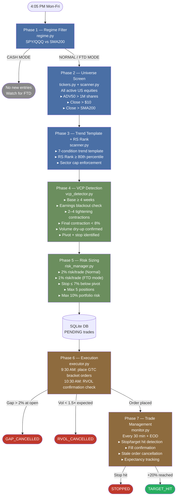
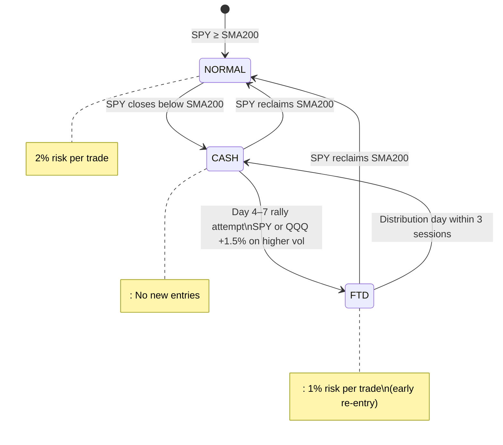
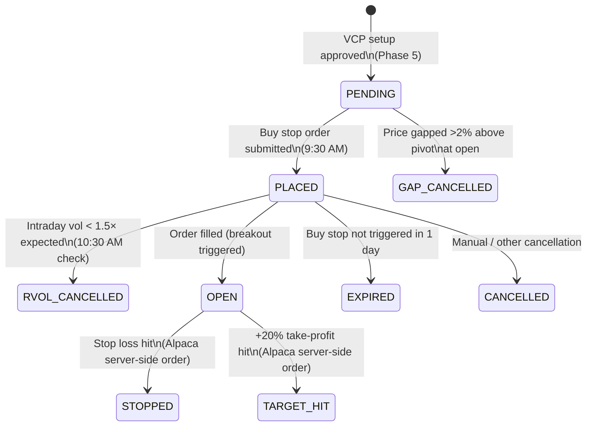
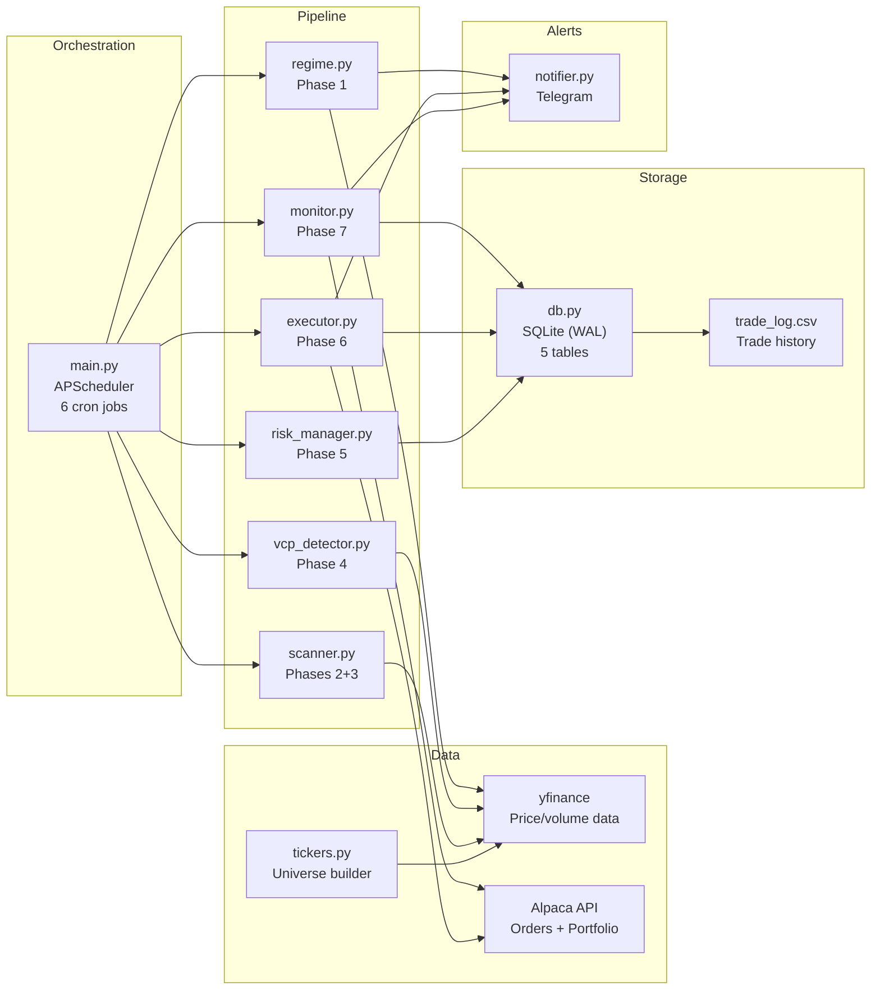

# VCPBot — VCP Momentum Breakout Trading Bot

A fully automated swing trading bot implementing **Mark Minervini's Volatility Contraction Pattern (VCP)** strategy on US equities. Long-only, daily timeframe, bracket orders via [Alpaca](https://alpaca.markets/). Deployed as a systemd service on Oracle Cloud.

> **Paper trading by default** — no real money at risk until you flip `ALPACA_PAPER=false`.

---

## Strategy Overview

VCP (Volatility Contraction Pattern) is a price structure where a stock forms a base with **successive tightening pullbacks** — each contraction shallower than the last — culminating in a pocket-pivot breakout above the pivot high on rising volume.

```
  PRICE
    │
    │                                                        🎯 +20% TARGET
    │  ─ ─ ─ ─ ─ ─ ─ ─ ─ ─ ─ ─ ─ ─ ─ ─ ─ ─ ─ ─ ─ ─ ─ ─ ─ ─ ─ ─ ─ ─ ─ ─
    │                                                       /
    │                                                      /  } REWARD +20%
    │  ════════════════════════════════════════════════════  ← BUY STOP ENTRY
    │         ╱╲                                      ╱       (pivot + $0.05)
    │        ╱  ╲             ╱╲              ╱╲     ╱
    │       ╱    ╲           ╱  ╲            ╱  ╲   ╱  ← Breakout on
    │      ╱      ╲         ╱    ╲          ╱    ╲ ╱     HIGH VOLUME
    │     ╱        ╲       ╱      ╲        ╱      ╳
    │    ╱          ╲     ╱        ╲      ╱      ╱ ╲
    │   ╱            ╲   ╱          ╲    ╱      ╱   ╲  } RISK ≤ 7%
    │  ╱   C1 ~25%    ╲ ╱   C2 ~15%  ╲  ╱ C3 <8%    ╲
    │ ╱                ╲╱             ╲╱              ─ ─ ─  STOP LOSS
    │                                                   (low of C3)
    │◄──────────────── BASE ≥ 4 WEEKS ─────────────────►│
    └──────────────────────────────────────────────────────────────► TIME

  VOLUME  (contractions show dry-up → breakout shows surge)
    │▐█▌                                                    ▐██▌
    │▐█▌ ▐▌                                           ▐▌   ▐██▌← surge
    │▐█▌ ▐█▌  ▐▌     ▐▌  ▐▌          ▐▌  ▐▌    ▐▌   ▐██▌  ▐██▌
    │▐█▌ ▐█▌ ▐█▌ ▐▌ ▐█▌ ▐█▌ ▐▌ ▐▌ ▐▌▐█▌ ▐█▌ ▐▌▐██▌  ▐██▌  ▐██▌
    └────────────────── volume drying up confirms VCP ──────────────► TIME
```

**Risk/Reward setup per trade:**

```
    ┌─────────────────────────────────────────────┐
    │                                             │
    │   🎯  PROFIT TARGET  (+20%)                 │
    │        ╱                                    │
    │       ╱  REWARD = 20%                       │
    │      ╱                                      │
    │─────╱──── ENTRY  (pivot + $0.05)  ──────────│  ← BUY STOP triggers here
    │      ╲                                      │
    │       ╲  RISK ≤ 7%                          │
    │        ╲                                    │
    │   🛑   STOP LOSS  (low of final contraction)│
    │                                             │
    │   Risk-to-Reward  ≥  1 : 2.8               │
    │   Position sized to risk 2% of equity       │
    └─────────────────────────────────────────────┘
```

---

## Architecture

### 7-Phase Pipeline (runs 4:05 PM daily after market close)



---

### Daily Schedule (US/Eastern)

```mermaid
gantt
    title VCPBot Daily Schedule (Mon–Fri)
    dateFormat HH:mm
    axisFormat %H:%M

    section Pre-Market
    Market Closed        :done, 00:00, 09:30

    section Market Hours
    Phase 6 — Place Orders         :crit, 09:30, 09:31
    RVOL Confirmation Check        :crit, 10:30, 10:31
    Phase 7 — Intraday Monitor ×13 :active, 09:30, 16:00

    section After Close
    Phase 1-5 Scan Pipeline        :crit, 16:05, 16:35
    Phase 7 — EOD Monitor          :16:05, 16:20
```



---

### Regime State Machine



---

### Trade Status Flow



---

### Component Map



---

## Setup

### 1. Clone & install

```bash
git clone https://github.com/blacckbeard4/VCPBot.git
cd VCPBot
python3.12 -m venv venv
source venv/bin/activate
pip install -r requirements.txt
```

### 2. Configure environment

```bash
cp .env.example .env
# Edit .env with your credentials
```

```env
ALPACA_API_KEY=your_key
ALPACA_SECRET_KEY=your_secret
ALPACA_PAPER=true              # set false for live trading

TELEGRAM_BOT_TOKEN=your_token
TELEGRAM_CHAT_ID=your_chat_id

ACCOUNT_VALUE=10000            # starting account size
MAX_POSITIONS=5
MAX_SECTOR_POSITIONS=2
MAX_DRAWDOWN_PCT=0.10
```

### 3. Run

```bash
# Test the full pipeline without placing any orders
python main.py --dry-run

# Run scan once and exit (useful for debugging)
python main.py --run-now

# Production scheduler
python main.py
```

---

## Deployment (Oracle Cloud VM)

```bash
# VM: Oracle Cloud VM.Standard.E2.1.Micro — 1GB RAM / 1 OCPU
# Ubuntu, 1GB RAM — memory-conscious batched processing

# Install as systemd service
sudo cp trading-bot.service /etc/systemd/system/
sudo systemctl enable trading-bot
sudo systemctl start trading-bot

# Logs
sudo journalctl -u trading-bot -f
```

---

## Key Strategy Parameters

| Parameter | Value | Description |
|---|---|---|
| Risk per trade (Normal) | 2% | % of equity risked |
| Risk per trade (FTD mode) | 1% | Reduced during early market recovery |
| Stop distance max | 7% below pivot | Hard reject if wider |
| Take-profit target | +20% | Linked bracket order on Alpaca |
| Entry trigger | pivot + $0.05 | GTC buy stop |
| Entry limit | pivot + $0.25 | Slippage buffer |
| Min base duration | 4 weeks | VCP base requirement |
| Final contraction max | 8% | Tightest squeeze |
| Min contractions | 2 | Need evidence of tightening |
| RS Rank minimum | 80th percentile | Top 20% relative strength |
| ADV50 minimum | 1,000,000 shares | Liquidity filter |
| Min price | $10 | Penny stock filter |

---

## SQLite Schema

```
vcpbot.db
├── trades           — every setup: PENDING → OPEN → STOPPED/TARGET_HIT
├── scan_log         — daily pipeline run stats
├── portfolio_state  — daily NAV + drawdown snapshots
├── regime_state     — persisted Cash/FTD state (survives restarts)
└── errors           — step-level error log
```

---

## Tech Stack

- **Python 3.12** — runtime
- **yfinance** — OHLCV price data
- **alpaca-py** — brokerage API (orders, portfolio)
- **APScheduler** — cron-style job scheduling
- **pandas / pandas-market-calendars** — data processing + NYSE calendar
- **SQLite (WAL mode)** — persistence
- **Telegram Bot API** — trade alerts

---

## Disclaimer

This software is for **educational and research purposes only**. It is not financial advice. Trading involves substantial risk of loss. Use paper trading mode until you fully understand the system behavior.
